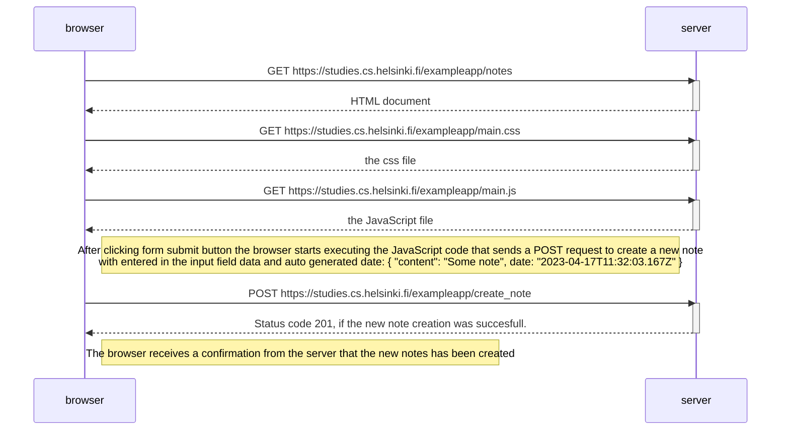

## New note diagram

&nbsp;

```mermaid

sequenceDiagram
participant browser
participant server as server

    browser->>server: GET https://studies.cs.helsinki.fi/exampleapp/notes
    activate server
    server-->>browser: HTML document
    deactivate server

    browser->>server: GET https://studies.cs.helsinki.fi/exampleapp/main.css
    activate server
    server-->>browser: the css file
    deactivate server

    browser->>server: GET https://studies.cs.helsinki.fi/exampleapp/main.js
    activate server
    server-->>browser: the JavaScript file
    deactivate server

    Note right of browser: After clicking form submit button the browser starts executing the JavaScript code that sends a POST request to create a new note <br> with entered in the input field data and auto generated date: { "content": "Some note", date: "2023-04-17T11:32:03.167Z" }

    browser->>server: POST https://studies.cs.helsinki.fi/exampleapp/create_note
    activate server
    server-->>browser: Status code 201, if the new note creation was succesfull.
    deactivate server

    Note right of browser: The browser receives a confirmation from the server that the new notes has been created

```
